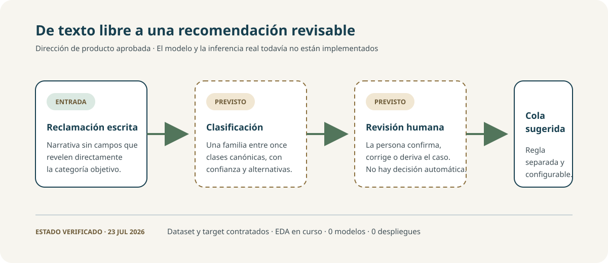
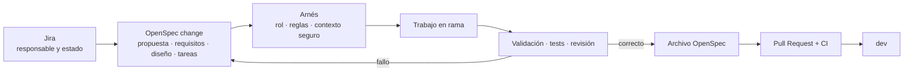
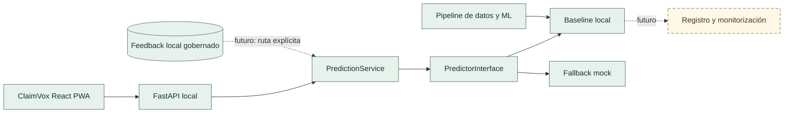
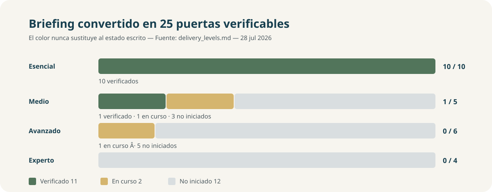

# ClaimVox · clasificación y enrutamiento asistido de reclamaciones

<p align="center">
  <strong>Proyecto 6 · Grupo 1 · MVP local de clasificación multiclase</strong>
</p>

<p align="center">
  <a href="https://github.com/Bootcamp-IA-MAD-P7/Proyecto6-Grupo1/actions/workflows/repository-quality.yml"></a>
  
  
  
  
</p>

> Una herramienta local de apoyo para proponer una categoría inicial de una reclamación financiera escrita. La propuesta siempre debe ser revisada por una persona; no enruta automáticamente ni toma decisiones financieras.



## Prueba ClaimVox en 5 minutos

### 1. Abre la demostración segura

```bash
git clone https://github.com/Bootcamp-IA-MAD-P7/Proyecto6-Grupo1.git
cd Proyecto6-Grupo1/app/interface
npm ci
npm run dev
```

Abre la dirección indicada, pulsa **Use a synthetic example** y después
**Classify complaint**. Sin una API configurada, la interfaz identifica el
resultado claramente como *mock*. Es el modo seguro para revisar la experiencia
sin datos locales, artefactos ni narrativas reales.

### 2. Qué se está demostrando

El recorrido muestra texto sintético → recomendación multiclase → revisión
humana. ClaimVox no enruta automáticamente, no toma decisiones financieras y
no lee el CSV de CFPB desde el navegador.

### 3. Inferencia local real —opcional

La inferencia local requiere un artefacto reproducible disponible en el equipo;
no se versionan particiones, datos ni binarios en Git. La [guía local de
ClaimVox](docs/project_management/essential_delivery_guide.md) separa el mock
seguro del recorrido con FastAPI, usa Git Bash y explica cómo comprobar
`/api/v1/health`. El flujo PWA → API ya está comprobado en el [smoke
local](reports/validation/claimvox_local_inference_smoke.md).

## Evaluación ejecutiva

| Pregunta | Respuesta verificable |
|---|---|
| Problema | Primera orientación para revisar reclamaciones financieras escritas. |
| Entrada | Solo `complaint_what_happened`; no se usan campos que revelan la clase. |
| Salida | Una de once clases canónicas, alternativas y revisión humana obligatoria. |
| Estado esencial | `10 de 10` criterios verificados para ejecución local. |
| Corte verificable | Tag anotado [`v0.1.0-essential-mvp`](https://github.com/Bootcamp-IA-MAD-P7/Proyecto6-Grupo1/tree/v0.1.0-essential-mvp). |
| Fuera de alcance | Despliegue, cuentas reales, base de datos compartida, interfaz de feedback, Docker, cloud y MLOps. |

> El tag representa un corte local, revisable y no desplegado. El detalle de
> los criterios y sus fuentes está en los [niveles de entrega](docs/project_management/delivery_levels.md).

## El MVP en un vistazo

| Dimensión | Estado verificable |
|---|---|
| Idea de negocio | Elegida por unanimidad: clasificación de reclamaciones CFPB |
| Dataset | Consumer Complaint Database, viable con condiciones |
| Corpus preparado | `T-005` y `T-006` completadas: 1.998.965 filas en inglés, particionadas localmente |
| Particiones locales | 1.396.019 train · 300.870 validation · 302.076 test protegido |
| Target | Once familias canónicas en `config/cfpb_target_contract.json` |
| Desbalanceo preliminar | Clase mayoritaria: 72,45 % |
| EDA y política de datos | EDA multiclase verificado; política inicial de idioma, grupos, split y desbalanceo aplicada |
| Modelo evaluado | Baseline LogisticRegression local sobre once clases; evaluación esencial actual con macro F1 validation `0.6390` y gap `0.0078`. |
| Comparativa posterior | RF, XGBoost y LightGBM comparados sobre una muestra de 50K. No hay Champion ni modelo seleccionado para producción. |
| Aplicación | ClaimVox React PWA: mock seguro por defecto y predicción local real mediante configuración explícita |
| Backend e inferencia | Servicio FastAPI y flujo PWA→API verificados localmente con un artefacto reproducible; sin despliegue |
| Feedback local | Repositorio SQLite local gobernado, sin endpoint, interfaz ni operación compartida |
| Despliegue, cuentas y MLOps | No implementados |
| Método de trabajo | OpenSpec + arnés implantados y comprobados |

ClaimVox permite revisar el recorrido con contenido sintético, dictado,
instalación PWA, preferencia de tema claro/oscuro/sistema y comportamiento
offline seguro. Con una URL local explícita, consume la respuesta del servicio
FastAPI y mantiene la revisión humana obligatoria; sin configuración conserva el
mock como modo seguro. La evidencia fusionada verifica `ESS-04` para la
integración local, pero no acredita un despliegue,
autenticación, persistencia operativa ni operación productiva. Véanse el [manual del
frontend](app/interface/README.md), el [manual del backend](app/api/README.md) y
el [smoke end-to-end](reports/validation/claimvox_local_inference_smoke.md).

### Qué se puede demostrar ahora

1. Se reconstruye un artefacto local reproducible desde las particiones aprobadas, sin añadir datos ni binarios a Git.
2. FastAPI carga ese artefacto y devuelve una predicción multiclase contractual.
3. ClaimVox consume el servicio solo cuando se configura una URL local explícita; en otro caso se identifica como mock.
4. La respuesta mantiene la revisión humana, no conserva el texto y aplica controles locales de tamaño, frecuencia, CORS y errores seguros.
5. La experiencia local identifica de forma visible la respuesta de API local frente al mock, muestra la versión disponible, limita las alternativas a tres y mantiene un motivo seguro de revisión humana. La navegación pública no presenta el inicio de sesión ni la administración conceptual como capacidades operativas.

### Qué no debe afirmarse

No hay despliegue público, autenticación real, base de datos compartida, endpoint o interfaz de feedback, analítica de usuarios, monitorización de producción, Docker, cloud ni MLOps. Existe únicamente un repositorio SQLite local, aislado y sin datos CFPB reales. El artefacto vive localmente y la aplicación no lee el CSV del CFPB.

### Evidencia esencial destacada

| Evidencia | Resultado | Fuente canónica |
|---|---:|---|
| Modelo funcional | Once clases y artefacto local reproducible | [evaluación esencial](reports/validation/cfpb_essential_evaluation.md) |
| Overfitting | Gap macro F1 train/validation `0.0078` (`< 0.05`) | [evaluación esencial](reports/validation/cfpb_essential_evaluation.md) |
| Accuracy | Validation `0.8684`; test protegido histórico `0.8230` | [niveles de entrega](docs/project_management/delivery_levels.md) |
| Métricas multiclase | Precision, recall y F1 por clase, macro y weighted | [métricas baseline](reports/validation/cfpb_baseline_metrics.json) |
| Diagnóstico | Matriz, importancia TF-IDF y análisis de errores | [evaluación esencial](reports/validation/cfpb_essential_evaluation.md) |
| Aplicación | PWA → API local, contrato y revisión humana | [smoke de integración](reports/validation/claimvox_local_inference_smoke.md) |

Las métricas de test se conservan como evaluación histórica protegida: no se
reutilizan para seleccionar, ajustar ni diagnosticar el modelo actual.

## El problema

Las organizaciones que reciben reclamaciones financieras deben interpretar texto libre y asignarlo a una categoría y un circuito. El proceso manual consume tiempo, puede ser inconsistente y se enfrenta a cambios de vocabulario, volumen y distribución.

La propuesta del equipo es estudiar si un modelo multiclase puede:

1. recibir una narrativa sin campos que revelen directamente la respuesta;
2. proponer una de once familias de producto;
3. mostrar confianza y alternativas;
4. permitir confirmación o corrección humana;
5. traducir la categoría a una cola mediante una regla separada.

No resolverá reclamaciones ni tomará decisiones financieras, legales o de elegibilidad.

## Datos y límites

| Contrato | Decisión vigente |
|---|---|
| Fuente | [Consumer Complaint Database del CFPB](https://www.consumerfinance.gov/data-research/consumer-complaints/) |
| Entrada candidata | `complaint_what_happened` |
| Target de origen | `product` |
| Target derivado | `product_canonical` |
| Número de clases | 11 |
| Exclusiones | Etiquetas ambiguas definidas por contrato |
| Leakage | Prohibidos los campos que revelan la clase |
| Privacidad | Ninguna narrativa real en Git, prompts, informes o presentaciones |
| Política inicial aprobada | Inglés, grupos completos, split temporal 70/15/15, mínimo 100 por clase en validation/test, macro F1 y pesos balanceados |

Evidencias: [informe de viabilidad](reports/validation/cfpb_viability.md), [contrato de target](config/cfpb_target_contract.json), [expediente del EDA](specs/001-cfpb-target-contract/spec.md), [constructor local](reports/validation/cfpb_training_dataset.md) y [preparación del baseline](reports/validation/cfpb_training_preparation.md). El informe EDA previo usa otra instantánea; sus cifras no se mezclan con la fuente de referencia aprobada para entrenamiento.

## Harness Engineering implantado

Este repositorio no se limita a tener muchos Markdown. El arnés conecta instrucciones, herramientas, entorno, estado y retroalimentación:

| Componente del arnés | Implementación real |
|---|---|
| Instrucciones | `AGENTS.md`, `openspec/config.yaml`, intención, contratos y briefing |
| Herramientas | OpenSpec local, roles, skills, generadores, GitHub Actions |
| Entorno | Node y Python fijados; instalación reproducible con lockfile |
| Estado | Cambios, tareas y capacidades versionados por OpenSpec; Jira para seguimiento |
| Retroalimentación | Validación estricta, tests, revisión, PR, CI y archivo |



### Qué aporta OpenSpec

- motor estándar de propuestas, requisitos, diseño y tareas;
- validación estricta antes de implementar;
- archivo histórico y especificaciones vigentes;
- adaptadores oficiales para Codex, GitHub Copilot, Claude Code, Cursor y Gemini CLI.

### Qué aporta nuestro arnés

- reglas de privacidad del CFPB;
- roles de arquitectura, datos, backend y frontend;
- contexto limitado a cada cambio;
- diagnóstico de instalación;
- paquetes seguros para una IA sin acceso al repositorio;
- bloqueo de cambios incompletos y PR con tareas pendientes.

### Qué sigue siendo humano

- aprobar alcance y decisiones;
- revisar datos, código, diff y evidencias;
- autorizar commit, push, archivo, PR y merge;
- decidir si el resultado satisface al usuario.

## Inicio rápido

```bash
git clone https://github.com/Bootcamp-IA-MAD-P7/Proyecto6-Grupo1.git
cd Proyecto6-Grupo1
git switch dev
npm ci
python scripts/harness.py doctor
```

Nuevo cambio:

```bash
git switch -c tipo/PG-N-descripcion-corta
npm exec -- openspec new change nombre-del-cambio \
  --goal "Resultado observable"
npm exec -- openspec status --change nombre-del-cambio
python scripts/harness.py start \
  --role architect \
  --change nombre-del-cambio \
  --jira PG-N
```

Víctor y Abel pueden terminar sus tareas anteriores mediante el modo de compatibilidad:

```bash
python scripts/harness.py start --role data-analyst --spec 001 --task T-004
python scripts/harness.py start --role frontend-developer --spec 003 --task T-006
```

Manuales: [OpenSpec + arnés para el equipo](docs/project_management/harness_quickstart.md)
y [Jira, OpenSpec y GitHub](docs/project_management/jira_workflow.md).

## Arquitectura construida y evolución prevista



La PWA, la API local, el servicio, el adaptador de predictor y el baseline son
capacidades construidas y verificadas para ejecución local. El repositorio de
feedback local está construido pero no está conectado a una ruta ni interfaz;
registro operativo, monitorización, autenticación y despliegue siguen siendo
arquitectura prevista.

| Construido ahora | Evolución gobernada después del MVP |
|---|---|
| PWA ClaimVox, FastAPI local, predictor intercambiable, baseline reproducible, repositorio local de feedback con privacidad y revisión humana | Ruta e interfaz de feedback, base de datos compartida, Docker, cloud, monitorización y promoción de modelos |

La separación de capas evita rehacer la aplicación: el frontend solo conoce el
contrato, la API delega en un predictor y el entrenamiento permanece fuera de
la inferencia. Véase el [blueprint arquitectónico](docs/architecture/system_blueprint.md).

Principios:

- dominio independiente de frameworks;
- entrenamiento separado de inferencia;
- contratos estables entre frontend, backend y modelo;
- configuración fuera del código;
- observabilidad sin datos sensibles;
- artefactos versionados y reversibles.

Detalle: [blueprint arquitectónico](docs/architecture/system_blueprint.md).

## Estado frente al briefing



Estado canónico: [niveles y evidencias](docs/project_management/delivery_levels.md).
Las dailies, informes puntuales, expedientes numerados y cambios OpenSpec
archivados conservan el contexto de su fecha; no sustituyen este estado vigente.

### Nivel esencial — 10 de 10 verificados

| ID | Criterio | Estado | Evidencia necesaria |
|---|---|---|---|
| ESS‑01 | Modelo multiclase funcional | `Verificado` | Baseline local reconstruible, manifiesto y predicciones válidas sobre once clases |
| ESS‑02 | EDA orientado a clasificación | `Verificado` | Script, informe, cuatro figuras agregadas, visualizaciones pertinentes y continuidad con la política de datos |
| ESS‑03 | Overfitting inferior al 5 % | `Verificado` | Macro F1 train/validation y gap `0.0482` en el informe del baseline |
| ESS‑04 | Aplicación que productiviza el modelo | `Verificado` | ClaimVox usa inferencia local real bajo configuración explícita, con errores seguros y revisión humana; no acredita despliegue |
| ESS‑05 | Accuracy global | `Verificado` | Validation `0.8484` y test protegido `0.8230` |
| ESS‑06 | Precision, recall y F1 por clase | `Verificado` | Once clases, agregados macro/weighted y JSON versionados |
| ESS‑07 | Matriz de confusión | `Verificado` | Matriz normalizada sobre validation completo |
| ESS‑08 | Feature importance | `Verificado` | Coeficientes TF-IDF agregados y limitaciones documentadas |
| ESS‑09 | Análisis de errores | `Verificado` | Clases débiles, confusiones agregadas y acciones de revisión humana |
| ESS‑10 | Informe técnico y guía | `Verificado` | Informe de evaluación y guía reproducible de ejecución local |

### Nivel medio — 1 de 5 verificados

| ID | Criterio | Estado | Evidencia necesaria |
|---|---|---|---|
| MED‑01 | Ensemble comparado con baseline | `Verificado` | RF, XGBoost y LightGBM comparados con el baseline en la misma muestra; XGBoost obtiene el mejor macro F1 de validación (`0.6332`), sin selección de modelo definitiva |
| MED‑02 | Validación cruzada estratificada | No iniciado | Folds, semillas y variabilidad |
| MED‑03 | Optimización de hiperparámetros | `En curso` | Optuna implementado en `src/ml/tuning.py`; pendiente ejecución con split completo |
| MED‑04 | Feedback y métricas operativas | `En curso` | Persistencia local minimizada con versión y privacidad; faltan interfaz y métricas operativas |
| MED‑05 | Recolección para reentrenamiento | `En curso` | Registro local trazable; faltan pipeline, validación y política de incorporación |

### Nivel avanzado — 3 de 6 verificados

| ID | Criterio | Estado | Evidencia necesaria |
|---|---|---|---|
| ADV‑01 | Dockerización completa | No iniciado | Imágenes, healthcheck y ejecución |
| ADV‑02 | Base de datos integrada | No iniciado | Esquema, migraciones y mínimo privilegio |
| ADV‑03 | Despliegue cloud | No iniciado | Entorno, smoke test y rollback |
| ADV‑04 | Tests de integridad de datos | `Verificado` | Puerta local de esquema, once clases, duplicados y fuga; 6 pruebas sintéticas |
| ADV‑05 | Tests del modelo | `Verificado` | Puerta local de carga, salida, clases e inferencia; 5 pruebas sintéticas |
| ADV‑06 | Tests de métricas mínimas | `Verificado` | Umbrales, gap estricto y test protegido como quality gates; 5 pruebas sintéticas |

### Nivel experto — 0 de 4 verificados

| ID | Criterio | Estado | Evidencia necesaria |
|---|---|---|---|
| EXP‑01 | Red neuronal multiclase | No iniciado | Evaluación comparable con Champion |
| EXP‑02 | A/B testing | No iniciado | Experimento o simulación reproducible |
| EXP‑03 | Data Drift con alertas | No iniciado | Referencia, umbrales y alerta verificable |
| EXP‑04 | Promoción automática gobernada | No iniciado | Champion/Challenger, aprobación y rollback |

Contrato detallado: [niveles y evidencias](docs/project_management/delivery_levels.md).

## Calidad automática

La Pull Request no puede integrarse en `dev` si falla `repository-quality`:

```text
npm ci
npm audit --audit-level=high
OpenSpec doctor
OpenSpec validate --all --strict
convenciones y enlaces del repositorio
tests unitarios
tests de contrato
whitespace del cambio
```

Además, `dev` exige PR, historial lineal, conversaciones resueltas y bloqueo de borrado y force-push. Las aprobaciones humanas están temporalmente en cero hasta que el equipo acuerde exigir reviewers.

## Por qué este MVP es profesional

La solidez de ClaimVox no viene de presentar un prototipo como producción. Viene
de poder demostrar, con límites explícitos, una cadena completa de valor:

| Dimensión | Evidencia de madurez |
|---|---|
| Producto responsable | Recomendación revisable, sin decisión automática ni promesas de enrutamiento. |
| Datos y modelo | Contrato de once clases, EDA, política de split, baseline reproducible y test protegido. |
| Evaluación | Accuracy, precision, recall, F1, gap train/validation, matriz, importancia y análisis agregado de errores. |
| Aplicación | PWA accesible y responsive, dictado opcional, estados de mock/offline/error y conexión local explícita. |
| Seguridad | Sin narrativas en evidencia, CORS de mínimo privilegio, límite de entrada, frecuencia local, errores seguros y eventos sin identidad. |
| Escalabilidad | Contratos y puertos permiten cambiar predictor, añadir feedback o desplegar adaptadores sin reescribir la experiencia actual. |
| Gobierno | OpenSpec, arnés, Jira, tests, PR y CI conectan cada cambio con una evidencia revisable. |

La narrativa para clientes debe comenzar por el problema y la revisión humana.
Las métricas, arquitectura y metodología sirven para demostrar la calidad de la
solución, no para ocultar sus límites. Véanse las fuentes de
[NotebookLM](#documentación-para-cliente-y-notebooklm).

## Estructura

```text
.
├── openspec/        # cambios, capacidades vigentes y reglas OpenSpec
├── ai-specs/        # roles y procedimientos propios del arnés
├── .codex/          # adaptadores oficiales OpenSpec para Codex
├── .github/         # CI, PR, Dependabot y adaptadores de Copilot
├── .claude/         # adaptadores oficiales para Claude Code
├── .cursor/         # adaptadores oficiales para Cursor
├── .gemini/         # adaptadores oficiales para Gemini CLI
├── .specify/        # intención global y plantillas históricas
├── specs/           # expedientes anteriores en compatibilidad
├── config/          # contratos y configuración no sensible
├── data/            # datos locales por etapa, fuera de Git
├── notebooks/       # EDA y experimentos narrativos
├── src/             # dominio, aplicación, ML e infraestructura
├── app/             # React PWA prototipo y futuras capas de entrega
├── tests/           # pruebas automatizadas
├── reports/         # evidencias agregadas y verificaciones
├── docs/            # arquitectura, producto, gestión y presentación
└── scripts/         # automatizaciones reproducibles
```

Las subcarpetas aparecen con su primer archivo real. No se crean árboles vacíos para simular madurez.

## Equipo y trabajo activo

| Persona | Área | Trabajo actual |
|---|---|---|
| José | Backend | `PG-5` verificado localmente; servicio usado por la integración local de `PG-6` |
| Abel | Frontend y UX | `PG-4` integrado; ClaimVox conserva mock seguro y admite servicio local configurado en `PG-6` |
| Víctor | Datos y EDA | `PG-2` completada; `PG-3` baseline evaluado; `MED-01` / `PG-8` comparativa ensemble verificada mediante PR #36; `MED-03` pendiente |
| Miguel | Arquitectura y método | Integración, evidencia y gobierno Jira–OpenSpec–arnés |

El [backlog `PG`](https://miguel-redondo.atlassian.net/browse/PG-1) sigue el nivel
esencial. Jira conserva responsable, estado y bloqueos; OpenSpec conserva
requisitos y decisiones; GitHub conserva implementación y evidencia.

## Documentación para cliente y NotebookLM

La narrativa para cliente comienza por el problema, el usuario, el valor y la evidencia; no por OpenSpec ni por terminología interna.

Fuentes principales:

- [narrativa de negocio](docs/notebooklm/business_narrative.md);
- [hechos verificados](docs/notebooklm/project_facts.md);
- [estado técnico](docs/notebooklm/technical_status.md);
- [catálogo y reglas de fuentes](docs/notebooklm/source_catalog.md);
- [dailies del equipo](docs/project_management/dailies/README.md).

Generación local:

```bash
python scripts/documentation/build_notebooklm_pack.py --date 2026-07-28
```

Antes de subir un paquete a NotebookLM se excluyen secretos, datos brutos, narrativas reales y fuentes internas que desordenen el relato de cliente.

## Seguridad y privacidad

- ninguna narrativa real en Git o servicios externos;
- allowlist de features y target versionado;
- secretos fuera del repositorio;
- dependencias auditadas y actualizadas mediante Dependabot;
- mínimo privilegio en workflows;
- revisión humana antes de acciones externas;
- [baseline de seguridad](docs/security/security_baseline.md) y [modelo de amenazas](docs/security/threat_model.md).

## Próximos hitos

1. Ejecutar [PG-11](https://miguel-redondo.atlassian.net/browse/PG-11): validación cruzada estratificada y optimización sin utilizar el test protegido para seleccionar.
2. Ejecutar [PG-12](https://miguel-redondo.atlassian.net/browse/PG-12): quality gates de integridad, modelo y métricas en CI.
3. Completar [PG-13](https://miguel-redondo.atlassian.net/browse/PG-13): interfaz y métricas de feedback sobre la persistencia local gobernada de [PG-14](https://miguel-redondo.atlassian.net/browse/PG-14), sin ampliar retención ni privacidad sin evidencia.
4. Abordar [PG-15](https://miguel-redondo.atlassian.net/browse/PG-15): Docker y despliegue reproducible después de estabilizar controles y persistencia.
5. Consultar la [hoja de ruta posterior](docs/project_management/mvp_delivery_roadmap.md) para dependencias, responsables y evidencia mínima.

## Referencias

- [OpenSpec](https://github.com/Fission-AI/OpenSpec)
- [LIDR Specboot, referencia del workshop](https://github.com/LIDR-academy/lidr-specboot)
- [Consumer Complaint Database](https://www.consumerfinance.gov/data-research/consumer-complaints/)
- [Contribución](CONTRIBUTING.md)
- [Seguridad](SECURITY.md)
- [Changelog](CHANGELOG.md)
