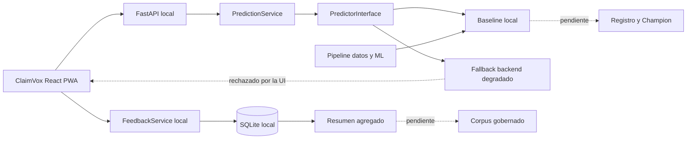
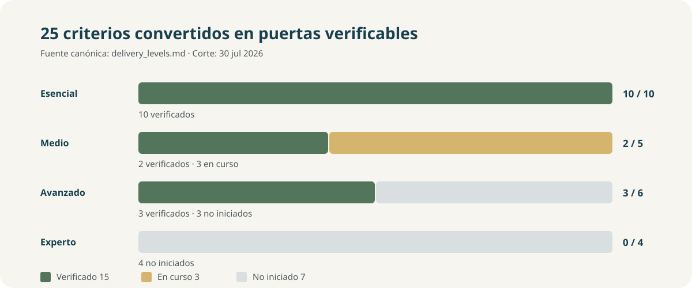

# ClaimVox · clasificación multiclase de reclamaciones financieras

<p align="center">
  <strong>Proyecto 6 · Grupo 1 · sistema local de apoyo a revisión humana</strong>
</p>

<p align="center">
  <a href="https://github.com/Bootcamp-IA-MAD-P7/Proyecto6-Grupo1/actions/workflows/repository-quality.yml"></a>
  
  
  
</p>

ClaimVox estudia un problema real de clasificación supervisada multiclase:
proponer una familia inicial para una reclamación financiera escrita. El
resultado apoya la revisión de una persona; no resuelve la reclamación, no la
enruta automáticamente y no toma decisiones financieras.


## Resumen ejecutivo

| Dimensión | Estado comprobable |
|---|---|
| Problema | Clasificación y apoyo al enrutamiento de reclamaciones financieras escritas |
| Dataset | Consumer Complaint Database del CFPB, procesado únicamente en local |
| Entrada del modelo | `complaint_what_happened` |
| Target | `product_canonical`, once clases mutuamente excluyentes |
| Modelo servido | Baseline TF-IDF + Logistic Regression local |
| Aplicación | React PWA → FastAPI local; sin API o modelo real no muestra clasificación |
| Feedback | Registro local minimizado, retención finita y resumen agregado |
| Entrega | 15/25 criterios verificados; esencial 10/10, medio 2/5, avanzado 3/6 |
| Gobierno | OpenSpec, arnés, Jira, Pull Requests y CI |
| Pendiente | Champion, CV completa convergida, corpus de reentrenamiento, Docker, base compartida, cloud y MLOps |

El corte anotado
[`v0.1.0-essential-mvp`](https://github.com/Bootcamp-IA-MAD-P7/Proyecto6-Grupo1/tree/v0.1.0-essential-mvp)
representa el nivel esencial local, revisable y no desplegado. El estado vigente
posterior al tag se mantiene en
[`delivery_levels.md`](docs/project_management/delivery_levels.md).

## Problema y enfoque

Las reclamaciones llegan como texto libre y requieren una primera
categorización consistente. ClaimVox aplica este flujo:

1. recibe una narrativa;
2. devuelve una de once familias de producto y hasta tres alternativas;
3. muestra confianza, versión del modelo y necesidad de revisión;
4. permite confirmar o corregir la sugerencia con metadatos minimizados;
5. expone únicamente un resumen agregado del feedback local.

La interfaz nunca consulta datasets ni artefactos de entrenamiento. La API no
registra ni devuelve la narrativa. La revisión humana es obligatoria incluso
cuando existe confianza numérica.

## Datos, partición y privacidad

| Contrato | Decisión vigente |
|---|---|
| Fuente | [Consumer Complaint Database](https://www.consumerfinance.gov/data-research/consumer-complaints/) |
| Preparación vigente | 1.961.073 filas en inglés, almacenadas solo en local |
| Particiones vigentes | 1.372.751 train · 294.161 validation · 294.161 test protegido |
| Separación | Temporal 70/15/15 y grupos completos por `narrative_hash` |
| Target | Once clases en [`cfpb_target_contract.json`](config/cfpb_target_contract.json) |
| Desbalanceo | `class_weight=balanced`; rendimiento macro y por clase obligatorio |
| Leakage | Prohibidos campos que revelen la clase; test no usado para seleccionar |
| Privacidad | No se versionan narrativas, datasets, predicciones por fila ni modelos |

Fuentes: [viabilidad](reports/validation/cfpb_viability.md),
[preparación](reports/validation/cfpb_training_preparation.md) y
[política de entrenamiento](config/cfpb_training_policy.json).

## Modelo y resultados

El baseline reproducible usa TF-IDF con bigramas y Logistic Regression
balanceada. La evaluación histórica que abrió el test protegido y sustenta
`ESS-03`/`ESS-05` procede de
[`cfpb_baseline_metrics.json`](reports/validation/cfpb_baseline_metrics.json):

| Métrica | Resultado |
|---|---:|
| Train macro F1 | `0.6455` |
| Validation macro F1 | `0.5973` |
| Gap train–validation | `0.0482` |
| Validation accuracy | `0.8484` |
| Test protegido accuracy | `0.8230` |
| Test protegido macro F1 | `0.6625` |

El gap cumple el límite esencial estricto inferior a `0.05`. La evaluación
incluye precision, recall y F1 para las once clases, matriz de confusión,
coeficientes TF-IDF agregados y análisis de errores. Las clases con menor F1 en
validation requieren especial atención humana; el promedio global no oculta
esa limitación.

Una reconstrucción posterior del candidato esencial sobre la preparación local
actual —sin abrir test— registró 1.372.751 filas de train, 294.161 de
validation, macro F1 `0.6390`, accuracy `0.8684` y gap `0.0078`. Ambas
ejecuciones se conservan porque corresponden a cortes distintos; sus tamaños y
resultados no deben mezclarse. Véase
[`cfpb_essential_evaluation.md`](reports/validation/cfpb_essential_evaluation.md).

La comparación `MED-01` evaluó Random Forest, XGBoost y LightGBM sobre la misma
muestra de 50.000 filas. XGBoost obtuvo el mayor macro F1 de validation
(`0.6332`), pero el experimento no selecciona un Champion. `MED-02` y `MED-03`
siguen en curso porque falta evidencia de CV completa convergida, variabilidad
final y optimización cerrada sin reutilizar test.

Evidencia: [evaluación esencial](reports/validation/cfpb_essential_evaluation.md)
y [comparación ensemble](reports/validation/med_01_comparison.md).

## Arquitectura implementada



Implementado en `dev`:

- PWA accesible con flujo guiado de cuatro pasos, carga, error y API local;
- FastAPI con health, validación, límites locales y errores seguros;
- predictor intercambiable y carga de artefacto desde ruta controlada;
- feedback posterior a predicción local, con campos cerrados y retención;
- resumen por versión, clase sugerida y decisión, sin registros individuales;
- quality gates sintéticos de datos, modelo y métricas.

No implementado:

- autenticación o permisos reales;
- base compartida, migraciones o acceso multiusuario;
- Docker, despliegue cloud o observabilidad de producción;
- registro de modelos, Champion/Challenger o promoción;
- corpus y reentrenamiento automático.

Detalle: [blueprint](docs/architecture/system_blueprint.md),
[OpenAPI](docs/api/openapi.json) y
[modelo de amenazas](docs/security/threat_model.md).

## Ejecución local

### Requisitos

- Python `3.12`;
- Node.js `>=20.19`;
- npm;
- artefacto local `models/cfpb_baseline.pkl` para inferencia real.

Instala el proyecto desde la raíz:

```bash
git clone https://github.com/Bootcamp-IA-MAD-P7/Proyecto6-Grupo1.git
cd Proyecto6-Grupo1
git switch dev
npm ci
python -m pip install -e .
python scripts/harness.py doctor
```

### Revisión de interfaz sin servicio

El frontend puede abrirse sin backend para revisar formulario, navegación y
accesibilidad, pero no muestra ninguna categoría sintética:

```bash
cd app/interface
npm ci
npm run dev -- --host 127.0.0.1 --port 5173 --strictPort
```

Abre <http://127.0.0.1:5173/classify> y utiliza **Use example**. Al intentar
clasificar debe aparecer un error recuperable y el texto debe permanecer en el
paso Review. Este recorrido permite revisar UX; no acredita inferencia.

### Inferencia y feedback locales

Terminal 1, desde la raíz:

```bash
export APP_CORS_ALLOWED_ORIGINS="http://127.0.0.1:5173"
python -m uvicorn app.api.main:app --host 127.0.0.1 --port 8000
```

Comprueba el predictor:

```bash
curl -s http://127.0.0.1:8000/api/v1/health
```

`"status":"ok"` confirma el artefacto local. Con `"degraded"` la API conserva
su fallback técnico, pero la interfaz rechaza esa respuesta y no muestra una
categoría. Terminal 2:

```bash
cd app/interface
export VITE_PREDICTION_API_BASE_URL="http://127.0.0.1:8000"
npm ci
npm run dev -- --host 127.0.0.1 --port 5173 --strictPort
```

Después de una predicción local válida se puede registrar feedback cerrado y
consultar su resumen:

```bash
curl -s http://127.0.0.1:8000/api/v1/feedback/summary
```

La guía completa, incluida la recuperación de caché PWA, está en
[`essential_delivery_guide.md`](docs/project_management/essential_delivery_guide.md).

## Estado frente al briefing



### Nivel esencial — 10 de 10 verificados

| ID | Criterio | Estado | Evidencia |
|---|---|---|---|
| ESS‑01 | Modelo multiclase funcional | `Verificado` | Baseline y manifiesto sobre once clases |
| ESS‑02 | EDA orientado a clasificación | `Verificado` | Notebook/script, informe y cuatro figuras agregadas |
| ESS‑03 | Overfitting inferior al 5 % | `Verificado` | Gap macro F1 `0.0482` |
| ESS‑04 | Aplicación que productiviza el modelo | `Verificado` | Flujo PWA → API local con revisión humana |
| ESS‑05 | Accuracy global | `Verificado` | Validation `0.8484`; test protegido `0.8230` |
| ESS‑06 | Precision, recall y F1 por clase | `Verificado` | Once clases y agregados macro/weighted |
| ESS‑07 | Matriz de confusión | `Verificado` | Validation completo |
| ESS‑08 | Feature importance | `Verificado` | Coeficientes TF-IDF agregados |
| ESS‑09 | Análisis de errores | `Verificado` | Clases débiles y confusiones |
| ESS‑10 | Informe técnico y guía | `Verificado` | Evaluación y ejecución reproducible |

### Nivel medio — 2 de 5 verificados

| ID | Criterio | Estado | Evidencia |
|---|---|---|---|
| MED‑01 | Ensemble comparado con baseline | `Verificado` | RF, XGBoost y LightGBM comparados sin selección definitiva |
| MED‑02 | Validación cruzada estratificada | `En curso` | Estrategia y semillas; falta CV completa convergida |
| MED‑03 | Optimización de hiperparámetros | `En curso` | Optuna implementado; falta cierre con evidencia completa |
| MED‑04 | Feedback y métricas operativas | `Verificado` | Predicción, feedback minimizado y resumen local E2E |
| MED‑05 | Recolección para reentrenamiento | `En curso` | Finalidad trazable; faltan corpus, validación y pipeline |

### Nivel avanzado — 3 de 6 verificados

| ID | Criterio | Estado | Evidencia |
|---|---|---|---|
| ADV‑01 | Dockerización completa | `No iniciado` | Imágenes, healthcheck y ejecución pendientes |
| ADV‑02 | Base de datos integrada | `No iniciado` | Esquema compartido, migraciones y privilegios pendientes |
| ADV‑03 | Despliegue cloud | `No iniciado` | Entorno, smoke y rollback pendientes |
| ADV‑04 | Tests de integridad de datos | `Verificado` | 6 pruebas sintéticas |
| ADV‑05 | Tests del modelo | `Verificado` | 5 pruebas sintéticas |
| ADV‑06 | Tests de métricas mínimas | `Verificado` | 5 pruebas sintéticas |

### Nivel experto — 0 de 4 verificados

| ID | Criterio | Estado | Evidencia |
|---|---|---|---|
| EXP‑01 | Red neuronal multiclase | `No iniciado` | Benchmark comparable pendiente |
| EXP‑02 | A/B testing | `No iniciado` | Experimento reproducible pendiente |
| EXP‑03 | Data drift con alertas | `No iniciado` | Referencia y alertas pendientes |
| EXP‑04 | Promoción automática gobernada | `No iniciado` | Champion/Challenger y rollback pendientes |

El contrato completo y sus evidencias mínimas están en
[`delivery_levels.md`](docs/project_management/delivery_levels.md).

## Evidencias principales

| Área | Evidencia |
|---|---|
| EDA | [`cfpb_eda.md`](reports/validation/cfpb_eda.md) |
| Dataset y particiones | [`cfpb_training_preparation.md`](reports/validation/cfpb_training_preparation.md) |
| Baseline | [`cfpb_baseline.md`](reports/validation/cfpb_baseline.md) |
| Evaluación esencial | [`cfpb_essential_evaluation.md`](reports/validation/cfpb_essential_evaluation.md) |
| Ensemble | [`med_01_comparison.md`](reports/validation/med_01_comparison.md) |
| Inferencia local | [`claimvox_local_inference_smoke.md`](reports/validation/claimvox_local_inference_smoke.md) |
| Feedback E2E | [`claimvox_local_feedback_e2e.md`](reports/validation/claimvox_local_feedback_e2e.md) |
| Quality gates | [`cfpb_quality_gates.md`](reports/validation/cfpb_quality_gates.md) |
| Auditoría vigente | [`project_truth_audit_2026-07-30.md`](reports/validation/project_truth_audit_2026-07-30.md) |

## Calidad y gobierno

La CI de Pull Requests ejecuta instalación reproducible, auditoría npm,
diagnóstico del arnés, validación estricta OpenSpec, quality gate documental,
tests unitarios y tests de contrato.

```bash
python scripts/quality/check_repository.py
python -m unittest discover -s tests/unit -p "test_*.py" -v
python -m unittest discover -s tests/contract -p "test_*.py" -v
npm run openspec:validate
```

El flujo de cambio es:

```text
Jira → OpenSpec → arnés → rama → pruebas/evidencia → revisión → PR → dev
```

- OpenSpec conserva requisitos, diseño, tareas y decisiones.
- El arnés prepara contexto seguro y controles por rol.
- Jira conserva asignación y estado operativo.
- GitHub conserva implementación, revisión y CI.
- Una capacidad cambia de estado por evidencia, no por intención.

Guías: [arnés](docs/project_management/harness_quickstart.md),
[workflow](docs/project_management/workflow.md) y
[Jira/OpenSpec/GitHub](docs/project_management/jira_workflow.md).

## Estructura

```text
openspec/        cambios activos, archivo y capacidades vigentes
ai-specs/        roles y procedimientos del arnés
config/          contratos y políticas no sensibles
data/            datos locales ignorados por Git
notebooks/       EDA reproducible y experimentos narrativos
src/ml/          vectorización, modelos, evaluación y tuning
app/api/         servicio FastAPI local
app/interface/   React PWA ClaimVox
scripts/         preparación, ML, calidad y documentación
tests/           pruebas unitarias, contrato e integración
reports/         evidencia agregada versionable
docs/            arquitectura, seguridad, gestión y presentación
```

## Documentación y NotebookLM

Las fuentes activas se separan por propósito:

- [hechos verificados](docs/notebooklm/project_facts.md);
- [estado técnico](docs/notebooklm/technical_status.md);
- [narrativa de negocio](docs/notebooklm/business_narrative.md);
- [catálogo de fuentes](docs/notebooklm/source_catalog.md);
- [guion de presentación](docs/presentations/claimvox_mvp_story.md);
- [dailies](docs/project_management/dailies/README.md).

Los cambios OpenSpec archivados, las dailies y los informes fechados conservan
su contexto histórico. No sustituyen el estado vigente de
`delivery_levels.md`.

## Equipo

| Persona | Responsabilidad principal |
|---|---|
| Miguel | Arquitectura, integración y gobierno |
| José | Backend |
| Abel | Frontend y UX |
| Víctor | Datos y EDA |

La actividad vigente se consulta en Jira; no se deduce de esta tabla. Josué no
forma parte del equipo activo.

## Seguridad y límites

- No usar narrativas reales del CFPB en Git, prompts, tests, capturas o servicios externos.
- La API limita entrada, aplica CORS local explícito y devuelve errores seguros.
- El feedback admite solo metadatos cerrados y no conserva identidad, texto libre ni probabilidades completas.
- La persistencia SQLite es local y no acredita una base integrada.
- El servicio no está autenticado ni desplegado.
- El modelo servido es un baseline local, no un Champion.

Consulta [SECURITY.md](SECURITY.md), el
[baseline de seguridad](docs/security/security_baseline.md) y el
[modelo de amenazas](docs/security/threat_model.md).

## Próximos hitos

1. Cerrar `PG-11` con evidencia convergida para `MED-02` y `MED-03`, o
   documentar formalmente el bloqueo sin promover un modelo.
2. Completar `MED-05` con corpus gobernado, validación, deduplicación y política
   de incorporación.
3. Abordar `PG-15`: Docker y despliegue reproducible.
4. Diseñar `ADV-02` como base compartida con migraciones y mínimo privilegio;
   la SQLite local actual no satisface ese criterio.
5. Mantener `PG-17` condicionado a un protocolo de monitorización y operación
   aprobado; `PG-16` queda limitado al rediseño local verificado.

## Referencias

- [CFPB Consumer Complaint Database](https://www.consumerfinance.gov/data-research/consumer-complaints/)
- [scikit-learn: text classification](https://scikit-learn.org/stable/tutorial/text_analytics/working_with_text_data.html)
- [FastAPI](https://fastapi.tiangolo.com/)
- [React](https://react.dev/)
- [OpenSpec](https://github.com/Fission-AI/OpenSpec)
