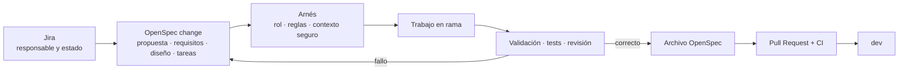
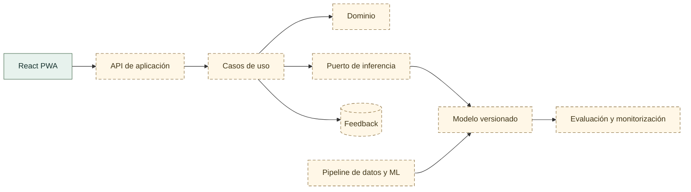
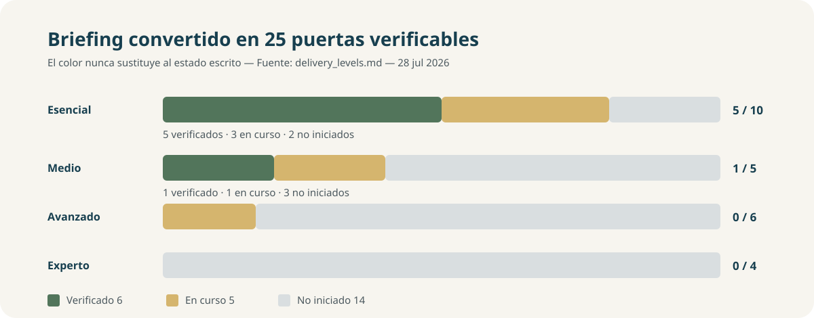

# Clasificación y enrutamiento asistido de reclamaciones

<p align="center">
  <strong>Proyecto 6 · Grupo 1 · Clasificación multiclase</strong>
</p>

<p align="center">
  <a href="https://github.com/Bootcamp-IA-MAD-P7/Proyecto6-Grupo1/actions/workflows/repository-quality.yml"></a>
  
  
  
  
</p>

> Una herramienta de apoyo para proponer la categoría y el circuito inicial de una reclamación financiera escrita. La propuesta siempre debe poder ser revisada por una persona.


## Estado de un vistazo

| Dimensión | Estado verificable |
|---|---|
| Idea de negocio | Elegida por unanimidad: clasificación de reclamaciones CFPB |
| Dataset | Consumer Complaint Database, viable con condiciones |
| Corpus preparado | `T-005` y `T-006` completadas: 1.998.965 filas en inglés, particionadas localmente |
| Particiones locales | 1.396.019 train · 300.870 validation · 302.076 test protegido |
| Target | Once familias canónicas en `config/cfpb_target_contract.json` |
| Desbalanceo preliminar | Clase mayoritaria: 72,45 % |
| EDA y política de datos | EDA multiclase verificado; política inicial de idioma, grupos, split y desbalanceo aplicada |
| Modelos | Baseline LogisticRegression (gap 0.0482 ✅); RF, XGBoost y LightGBM comparados sobre una muestra de 50K. No hay modelo seleccionado para producción. |
| Aplicación | ClaimVox React PWA: mock seguro por defecto y predicción local real mediante configuración explícita |
| Backend e inferencia | Servicio FastAPI y flujo PWA→API verificados localmente con un artefacto reproducible; sin despliegue |
| Despliegue y MLOps | No iniciados |
| Método de trabajo | OpenSpec + arnés implantados y comprobados |

ClaimVox permite revisar el recorrido con contenido sintético, dictado,
instalación PWA, preferencia de tema claro/oscuro/sistema y comportamiento
offline seguro. Con una URL local explícita, consume la respuesta del servicio
FastAPI y mantiene la revisión humana obligatoria; sin configuración conserva el
mock como modo seguro. La evidencia fusionada verifica `ESS-04` para la
integración local, pero no acredita un despliegue,
autenticación, persistencia ni operación productiva. Véanse el [manual del
frontend](app/interface/README.md), el [manual del backend](app/api/README.md) y
el [smoke end-to-end](reports/validation/claimvox_local_inference_smoke.md).

## El problema

Las organizaciones que reciben reclamaciones financieras deben interpretar texto libre y asignarlo a una categoría y un circuito. El proceso manual consume tiempo, puede ser inconsistente y se enfrenta a cambios de vocabulario, volumen y distribución.

La propuesta del equipo es estudiar si un modelo multiclase puede:

1. recibir una narrativa sin campos que revelen directamente la respuesta;
2. proponer una de once familias de producto;
3. mostrar confianza y alternativas;
4. permitir confirmación o corrección humana;
5. traducir la categoría a una cola mediante una regla separada.

No resolverá reclamaciones ni tomará decisiones financieras, legales o de elegibilidad.

## Datos y límites

| Contrato | Decisión vigente |
|---|---|
| Fuente | [Consumer Complaint Database del CFPB](https://www.consumerfinance.gov/data-research/consumer-complaints/) |
| Entrada candidata | `complaint_what_happened` |
| Target de origen | `product` |
| Target derivado | `product_canonical` |
| Número de clases | 11 |
| Exclusiones | Etiquetas ambiguas definidas por contrato |
| Leakage | Prohibidos los campos que revelan la clase |
| Privacidad | Ninguna narrativa real en Git, prompts, informes o presentaciones |
| Política inicial aprobada | Inglés, grupos completos, split temporal 70/15/15, mínimo 100 por clase en validation/test, macro F1 y pesos balanceados |

Evidencias: [informe de viabilidad](reports/validation/cfpb_viability.md), [contrato de target](config/cfpb_target_contract.json), [expediente del EDA](specs/001-cfpb-target-contract/spec.md), [constructor local](reports/validation/cfpb_training_dataset.md) y [preparación del baseline](reports/validation/cfpb_training_preparation.md). El informe EDA previo usa otra instantánea; sus cifras no se mezclan con la fuente de referencia aprobada para entrenamiento.

## Harness Engineering implantado

Este repositorio no se limita a tener muchos Markdown. El arnés conecta instrucciones, herramientas, entorno, estado y retroalimentación:

| Componente del arnés | Implementación real |
|---|---|
| Instrucciones | `AGENTS.md`, `openspec/config.yaml`, intención, contratos y briefing |
| Herramientas | OpenSpec local, roles, skills, generadores, GitHub Actions |
| Entorno | Node y Python fijados; instalación reproducible con lockfile |
| Estado | Cambios, tareas y capacidades versionados por OpenSpec; Jira para seguimiento |
| Retroalimentación | Validación estricta, tests, revisión, PR, CI y archivo |



### Qué aporta OpenSpec

- motor estándar de propuestas, requisitos, diseño y tareas;
- validación estricta antes de implementar;
- archivo histórico y especificaciones vigentes;
- adaptadores oficiales para Codex, GitHub Copilot, Claude Code, Cursor y Gemini CLI.

### Qué aporta nuestro arnés

- reglas de privacidad del CFPB;
- roles de arquitectura, datos, backend y frontend;
- contexto limitado a cada cambio;
- diagnóstico de instalación;
- paquetes seguros para una IA sin acceso al repositorio;
- bloqueo de cambios incompletos y PR con tareas pendientes.

### Qué sigue siendo humano

- aprobar alcance y decisiones;
- revisar datos, código, diff y evidencias;
- autorizar commit, push, archivo, PR y merge;
- decidir si el resultado satisface al usuario.

## Inicio rápido

```bash
git clone https://github.com/Bootcamp-IA-MAD-P7/Proyecto6-Grupo1.git
cd Proyecto6-Grupo1
git switch dev
npm ci
python scripts/harness.py doctor
```

Nuevo cambio:

```bash
git switch -c tipo/PG-N-descripcion-corta
npm exec -- openspec new change nombre-del-cambio \
  --goal "Resultado observable"
npm exec -- openspec status --change nombre-del-cambio
python scripts/harness.py start \
  --role architect \
  --change nombre-del-cambio \
  --jira PG-N
```

Víctor y Abel pueden terminar sus tareas anteriores mediante el modo de compatibilidad:

```bash
python scripts/harness.py start --role data-analyst --spec 001 --task T-004
python scripts/harness.py start --role frontend-developer --spec 003 --task T-006
```

Manuales: [OpenSpec + arnés para el equipo](docs/project_management/harness_quickstart.md)
y [Jira, OpenSpec y GitHub](docs/project_management/jira_workflow.md).

## Arquitectura prevista



La React PWA representa un prototipo validado y fusionado en `dev`, con
respuestas sintéticas. Los demás nodos siguen
siendo arquitectura prevista; el diagrama no acredita backend, modelo,
persistencia, inferencia ni monitorización reales.

Principios:

- dominio independiente de frameworks;
- entrenamiento separado de inferencia;
- contratos estables entre frontend, backend y modelo;
- configuración fuera del código;
- observabilidad sin datos sensibles;
- artefactos versionados y reversibles.

Detalle: [blueprint arquitectónico](docs/architecture/system_blueprint.md).

## Estado frente al briefing



### Nivel esencial — 5 de 10 verificados

| ID | Criterio | Estado | Evidencia necesaria |
|---|---|---|---|
| ESS‑01 | Modelo multiclase funcional | `En curso` | Pipeline, artefacto y predicciones válidas |
| ESS‑02 | EDA orientado a clasificación | `Verificado` | Script, informe, cuatro figuras agregadas, visualizaciones pertinentes y continuidad con la política de datos |
| ESS‑03 | Overfitting inferior al 5 % | `Verificado` | Macro F1 train/validation y gap `0.0482` en el informe del baseline |
| ESS‑04 | Aplicación que productiviza el modelo | `Verificado` | ClaimVox usa inferencia local real bajo configuración explícita, con errores seguros y revisión humana; no acredita despliegue |
| ESS‑05 | Accuracy global | `Verificado` | Validation `0.8484` y test protegido `0.8230` |
| ESS‑06 | Precision, recall y F1 por clase | `Verificado` | Once clases, agregados macro/weighted y JSON versionados |
| ESS‑07 | Matriz de confusión | `En curso` | Figuras generadas para RF y XGB (sample 50K); pendiente sobre split completo |
| ESS‑08 | Feature importance | `En curso` | Figuras generadas para RF y XGB (sample 50K); pendiente sobre split completo |
| ESS‑09 | Análisis de errores | No iniciado | Patrones por clase y acciones |
| ESS‑10 | Informe técnico y guía | No iniciado | Métricas, decisiones, límites y ejecución |

### Nivel medio — 1 de 5 verificados

| ID | Criterio | Estado | Evidencia necesaria |
|---|---|---|---|
| MED‑01 | Ensemble comparado con baseline | `Verificado` | RF, XGBoost y LightGBM comparados con el baseline en la misma muestra; XGBoost obtiene el mejor macro F1 de validación (`0.6332`), sin selección de modelo definitiva |
| MED‑02 | Validación cruzada estratificada | No iniciado | Folds, semillas y variabilidad |
| MED‑03 | Optimización de hiperparámetros | `En curso` | Optuna implementado en `src/ml/tuning.py`; pendiente ejecución con split completo |
| MED‑04 | Feedback y métricas operativas | No iniciado | Versión de modelo y privacidad |
| MED‑05 | Recolección para reentrenamiento | No iniciado | Pipeline, trazabilidad y validación |

### Nivel avanzado — 0 de 6 verificados

| ID | Criterio | Estado | Evidencia necesaria |
|---|---|---|---|
| ADV‑01 | Dockerización completa | No iniciado | Imágenes, healthcheck y ejecución |
| ADV‑02 | Base de datos integrada | No iniciado | Esquema, migraciones y mínimo privilegio |
| ADV‑03 | Despliegue cloud | No iniciado | Entorno, smoke test y rollback |
| ADV‑04 | Tests de integridad de datos | No iniciado | Esquema, clases, duplicados y leakage |
| ADV‑05 | Tests del modelo | `En curso` | Carga, salida, clases e inferencia; falta convertir los umbrales en gate completo |
| ADV‑06 | Tests de métricas mínimas | No iniciado | Umbrales y overfitting como quality gates |

### Nivel experto — 0 de 4 verificados

| ID | Criterio | Estado | Evidencia necesaria |
|---|---|---|---|
| EXP‑01 | Red neuronal multiclase | No iniciado | Evaluación comparable con Champion |
| EXP‑02 | A/B testing | No iniciado | Experimento o simulación reproducible |
| EXP‑03 | Data Drift con alertas | No iniciado | Referencia, umbrales y alerta verificable |
| EXP‑04 | Promoción automática gobernada | No iniciado | Champion/Challenger, aprobación y rollback |

Contrato detallado: [niveles y evidencias](docs/project_management/delivery_levels.md).

## Calidad automática

La Pull Request no puede integrarse en `dev` si falla `repository-quality`:

```text
npm ci
npm audit --audit-level=high
OpenSpec doctor
OpenSpec validate --all --strict
convenciones y enlaces del repositorio
tests unitarios
tests de contrato
whitespace del cambio
```

Además, `dev` exige PR, historial lineal, conversaciones resueltas y bloqueo de borrado y force-push. Las aprobaciones humanas están temporalmente en cero hasta que el equipo acuerde exigir reviewers.

## Estructura

```text
.
├── openspec/        # cambios, capacidades vigentes y reglas OpenSpec
├── ai-specs/        # roles y procedimientos propios del arnés
├── .codex/          # adaptadores oficiales OpenSpec para Codex
├── .github/         # CI, PR, Dependabot y adaptadores de Copilot
├── .claude/         # adaptadores oficiales para Claude Code
├── .cursor/         # adaptadores oficiales para Cursor
├── .gemini/         # adaptadores oficiales para Gemini CLI
├── .specify/        # intención global y plantillas históricas
├── specs/           # expedientes anteriores en compatibilidad
├── config/          # contratos y configuración no sensible
├── data/            # datos locales por etapa, fuera de Git
├── notebooks/       # EDA y experimentos narrativos
├── src/             # dominio, aplicación, ML e infraestructura
├── app/             # React PWA prototipo y futuras capas de entrega
├── tests/           # pruebas automatizadas
├── reports/         # evidencias agregadas y verificaciones
├── docs/            # arquitectura, producto, gestión y presentación
└── scripts/         # automatizaciones reproducibles
```

Las subcarpetas aparecen con su primer archivo real. No se crean árboles vacíos para simular madurez.

## Equipo y trabajo activo

| Persona | Área | Trabajo actual |
|---|---|---|
| José | Backend | `PG-5` verificado localmente; servicio usado por la integración local de `PG-6` |
| Abel | Frontend y UX | `PG-4` integrado; ClaimVox conserva mock seguro y admite servicio local configurado en `PG-6` |
| Víctor | Datos y EDA | `PG-2` completada; `PG-3` baseline evaluado; `MED-01` / `PG-8` comparativa ensemble verificada mediante PR #36; `MED-03` pendiente |
| Miguel | Arquitectura y método | Integración, evidencia y gobierno Jira–OpenSpec–arnés |

El [backlog `PG`](https://miguel-redondo.atlassian.net/browse/PG-1) sigue el nivel
esencial. Jira conserva responsable, estado y bloqueos; OpenSpec conserva
requisitos y decisiones; GitHub conserva implementación y evidencia.

## Documentación para cliente y NotebookLM

La narrativa para cliente comienza por el problema, el usuario, el valor y la evidencia; no por OpenSpec ni por terminología interna.

Fuentes principales:

- [narrativa de negocio](docs/notebooklm/business_narrative.md);
- [hechos verificados](docs/notebooklm/project_facts.md);
- [estado técnico](docs/notebooklm/technical_status.md);
- [catálogo y reglas de fuentes](docs/notebooklm/source_catalog.md);
- [dailies del equipo](docs/project_management/dailies/README.md).

Generación local:

```bash
python scripts/documentation/build_notebooklm_pack.py --date 2026-07-24
```

Antes de subir un paquete a NotebookLM se excluyen secretos, datos brutos, narrativas reales y fuentes internas que desordenen el relato de cliente.

## Seguridad y privacidad

- ninguna narrativa real en Git o servicios externos;
- allowlist de features y target versionado;
- secretos fuera del repositorio;
- dependencias auditadas y actualizadas mediante Dependabot;
- mínimo privilegio en workflows;
- revisión humana antes de acciones externas;
- [baseline de seguridad](docs/security/security_baseline.md) y [modelo de amenazas](docs/security/threat_model.md).

## Próximos hitos

1. Mantener el test protegido y cerrar la procedencia/versionado formal del artefacto antes de seleccionar un Champion.
2. Completar matriz de confusión, importancia de variables, análisis de errores e informe técnico del nivel esencial.
3. Comparar candidatos posteriores con el baseline sin utilizar el test protegido para seleccionarlos.
4. Definir autenticación, despliegue y operación solo mediante cambios específicos posteriores.
5. Proteger primero el nivel esencial; investigar niveles superiores sin desestabilizarlo.

## Referencias

- [OpenSpec](https://github.com/Fission-AI/OpenSpec)
- [LIDR Specboot, referencia del workshop](https://github.com/LIDR-academy/lidr-specboot)
- [Consumer Complaint Database](https://www.consumerfinance.gov/data-research/consumer-complaints/)
- [Contribución](CONTRIBUTING.md)
- [Seguridad](SECURITY.md)
- [Changelog](CHANGELOG.md)
