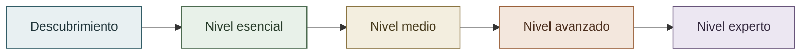

# Proyecto de Clasificación Multiclase

Repositorio del Proyecto 6 del Grupo 1.

<p align="center">
  
  
  
</p>

## Estado actual

El proyecto se encuentra en fase de descubrimiento y definición.

Todavía no se han decidido:

- la idea de negocio;
- el dataset;
- las clases que se predecirán;
- la métrica principal;
- el framework de aplicación;
- la arquitectura de despliegue.

La estructura inicial prepara el repositorio para evolucionar desde el nivel esencial hasta el nivel experto del briefing, sin presentar ninguna capacidad como implementada antes de tiempo.

## Objetivo académico

Construir una solución de clasificación supervisada multiclase con un mínimo de tres clases, análisis exploratorio, evaluación por clase, aplicación de inferencia y control de overfitting inferior al 5 %.

El alcance aspiracional incluye modelos ensemble, validación cruzada, optimización, feedback, recolección de datos, Docker, base de datos, despliegue, tests, redes neuronales y un ciclo MLOps con A/B testing, Data Drift y promoción controlada de modelos.

## Evolución prevista



| Nivel | Resultado protegido | Estado |
|---|---|---|
| Descubrimiento | Idea, usuario, datos y viabilidad | En curso |
| Esencial | Solución multiclase completa y demostrable | No iniciado |
| Medio | Champion, feedback y recolección | No iniciado |
| Avanzado | Contenedores, persistencia, cloud y tests | No iniciado |
| Experto | Challenger, A/B, drift y promoción gobernada | No iniciado |

## Estructura

```text
.
├── .specify/              # Método y plantillas para trabajar con specs
├── specs/                 # Una carpeta por funcionalidad o cambio relevante
├── app/                   # Capa de entrega: interfaz y, si aplica, API
├── config/                # Configuración versionada no sensible
├── data/                  # Datos por etapa del procesamiento
├── docs/                  # Arquitectura, decisiones y gestión del proyecto
├── infra/                 # Docker y despliegue en la nube
├── models/                # Artefactos y metadatos de modelos
├── notebooks/             # Exploración y experimentos narrativos
├── reports/               # Métricas, figuras y evidencias de validación
├── scripts/               # Automatizaciones reproducibles
├── src/                   # Código reutilizable de datos, ML y MLOps
└── tests/                 # Pruebas por nivel
```

La responsabilidad de cada carpeta se detalla en [docs/architecture/repository_structure.md](docs/architecture/repository_structure.md).

## Pilares de calidad

| Pilar | Aplicación desde el inicio |
|---|---|
| Producto y UX | Investigación, flujos, accesibilidad y sistema visual antes de las pantallas. |
| Datos y ML | Contratos, reproducibilidad, evaluación por clase y test final protegido. |
| Plataforma | Docker y CI/CD diseñados desde la fundación, activados por etapas. |
| Seguridad | Secretos, datos, dependencias y permisos con mínimo privilegio. |
| Documentación | README, diagramas, evidencias, dailies y fuentes curadas para NotebookLM. |
| Gobierno | Specs, ADR, PR, tags, releases y quality gates trazables. |

## Forma de trabajo

Los cambios relevantes seguirán este flujo:

```text
idea -> spec -> plan -> tareas -> implementación -> verificación -> cierre
```

La guía está en [.specify/README.md](.specify/README.md) y las normas de colaboración en [CONTRIBUTING.md](CONTRIBUTING.md).

## Ramas

- `dev`: rama de integración y rama predeterminada durante el desarrollo.
- `main`: se reservará para versiones estables cuando exista una primera entrega verificable.
- Ramas de trabajo: se crearán desde `dev` y volverán mediante Pull Request.

## Objetivos de madurez

- [Mapa de niveles y evidencias](docs/project_management/delivery_levels.md)
- [Principios de calidad del proyecto](docs/project_management/project_principles.md)
- [Gobierno Git y releases](docs/project_management/git_governance.md)
- [Estrategia CI/CD](docs/project_management/ci_cd_strategy.md)

## Documentación viva

La documentación se considera parte del producto. Debe alimentar el trabajo diario, las revisiones, las presentaciones y las fuentes curadas para NotebookLM.

- [Sistema de fuentes para NotebookLM](docs/notebooklm/README.md)
- [Dailies del equipo](docs/project_management/dailies/README.md)
- [Estándar visual de documentación](docs/design/documentation_visual_standard.md)
- [Blueprint arquitectónico](docs/architecture/system_blueprint.md)
- [Baseline de seguridad](docs/security/security_baseline.md)
- [Estrategia de pruebas](docs/quality/test_strategy.md)

## Próximo hito

Definir y comparar ideas de negocio antes de seleccionar dataset, stack o arquitectura funcional.
