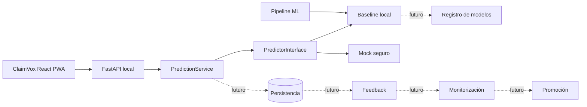

# Blueprint arquitectónico

## Objetivo

Mantener una base escalable y testeable con ClaimVox React PWA y FastAPI local
como recorrido esencial ya verificado, sin fijar prematuramente persistencia ni
proveedor cloud.

## Vista lógica

La PWA, FastAPI local, `PredictionService`, la interfaz de predictor, el
baseline local y el fallback mock están implementados y probados para ejecución
local. Persistencia, registro, feedback, monitorización, promoción y despliegue
siguen siendo responsabilidades previstas. Sus contratos se concretarán mediante
OpenSpec y decisiones versionadas antes de implementarlos.

React PWA debe cubrir primero el flujo web instalable y responsive. Una aplicación nativa no forma parte del alcance aprobado; se evaluará únicamente si requisitos de dispositivo, distribución o experiencia demuestran que la PWA no es suficiente.

## Límites

### Dominio

Contiene lenguaje y reglas del problema. No conoce Streamlit, Dash, Gradio, HTTP, SQL, Docker ni proveedores cloud.

### Aplicación

Orquesta casos de uso como predecir, registrar feedback o consultar el estado del modelo mediante puertos.

### Infraestructura

Implementa persistencia, carga de artefactos, observabilidad y servicios externos. Es reemplazable sin modificar el dominio.

### ML

Construye artefactos reproducibles y metadatos compatibles con el contrato de inferencia.

### MLOps

Observa, compara y propone cambios de versión. La promoción debe estar gobernada, auditada y ser reversible.

## Reglas de escalabilidad

- Procesos de entrenamiento separados de la inferencia online.
- Artefactos inmutables y versionados.
- Configuración externa al código.
- Contratos estables entre aplicación y modelo.
- Persistencia detrás de interfaces.
- Operaciones idempotentes cuando sea posible.
- Observabilidad sin registrar datos sensibles.
