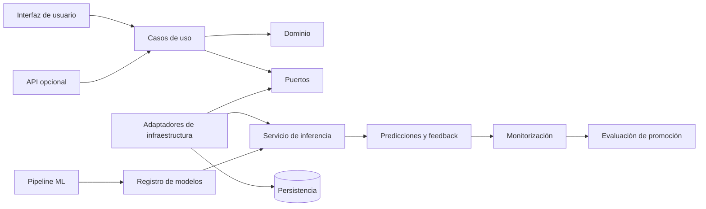

# Blueprint arquitectónico

## Objetivo

Preparar una base escalable y testeable sin fijar prematuramente frameworks o proveedores.

## Vista lógica

Todos los elementos salvo la estructura de carpetas son responsabilidades previstas. La tecnología y los contratos se concretarán mediante specs y ADR.

## Límites

### Dominio

Contiene lenguaje y reglas del problema. No conoce Streamlit, Dash, Gradio, HTTP, SQL, Docker ni proveedores cloud.

### Aplicación

Orquesta casos de uso como predecir, registrar feedback o consultar el estado del modelo mediante puertos.

### Infraestructura

Implementa persistencia, carga de artefactos, observabilidad y servicios externos. Es reemplazable sin modificar el dominio.

### ML

Construye artefactos reproducibles y metadatos compatibles con el contrato de inferencia.

### MLOps

Observa, compara y propone cambios de versión. La promoción debe estar gobernada, auditada y ser reversible.

## Reglas de escalabilidad

- Procesos de entrenamiento separados de la inferencia online.
- Artefactos inmutables y versionados.
- Configuración externa al código.
- Contratos estables entre aplicación y modelo.
- Persistencia detrás de interfaces.
- Operaciones idempotentes cuando sea posible.
- Observabilidad sin registrar datos sensibles.
